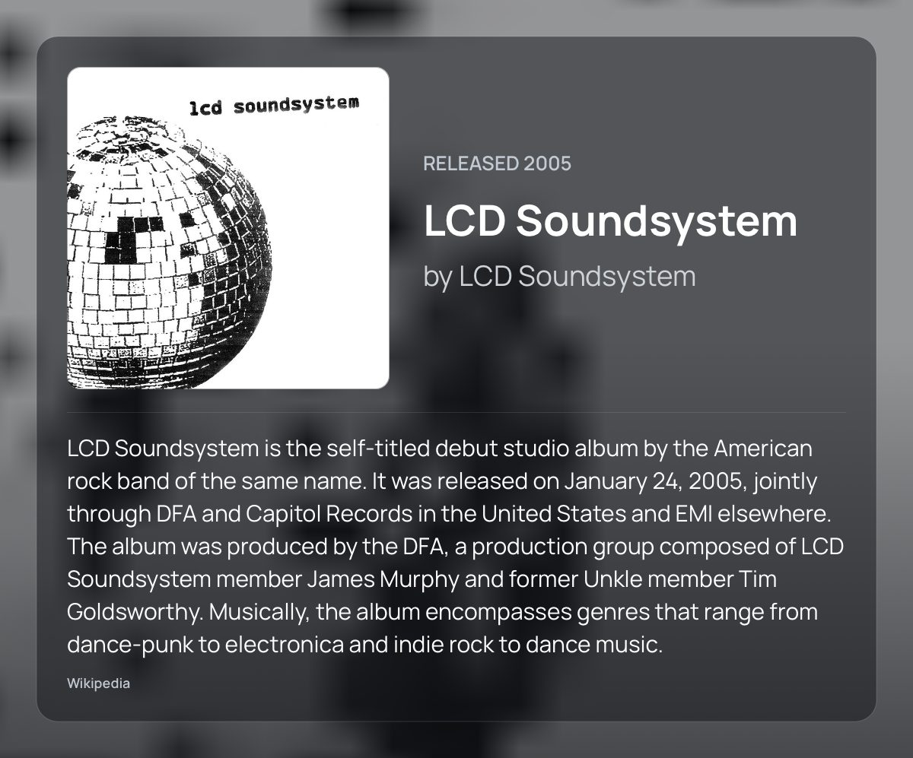
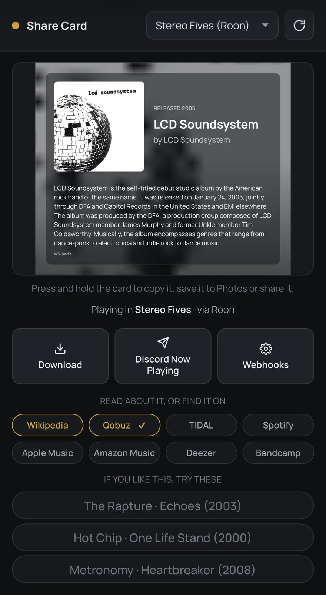
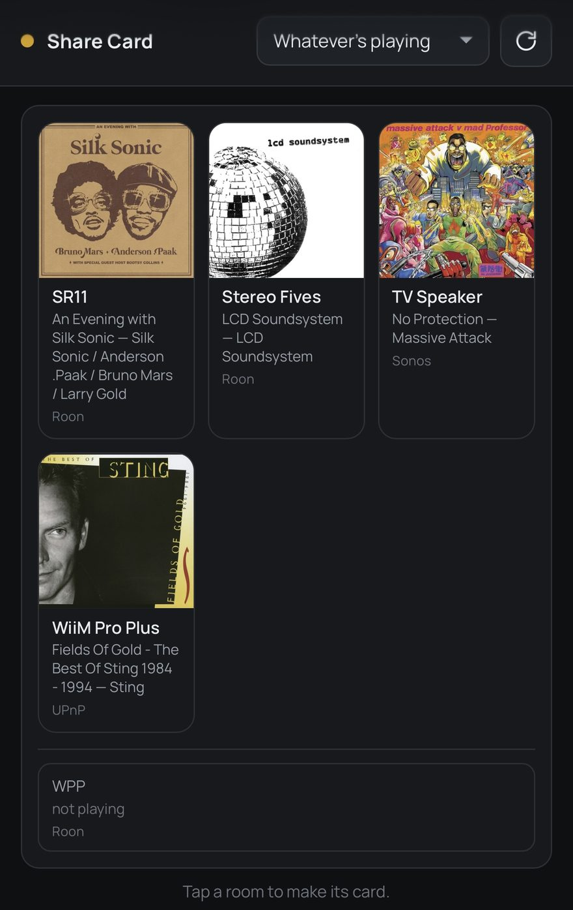
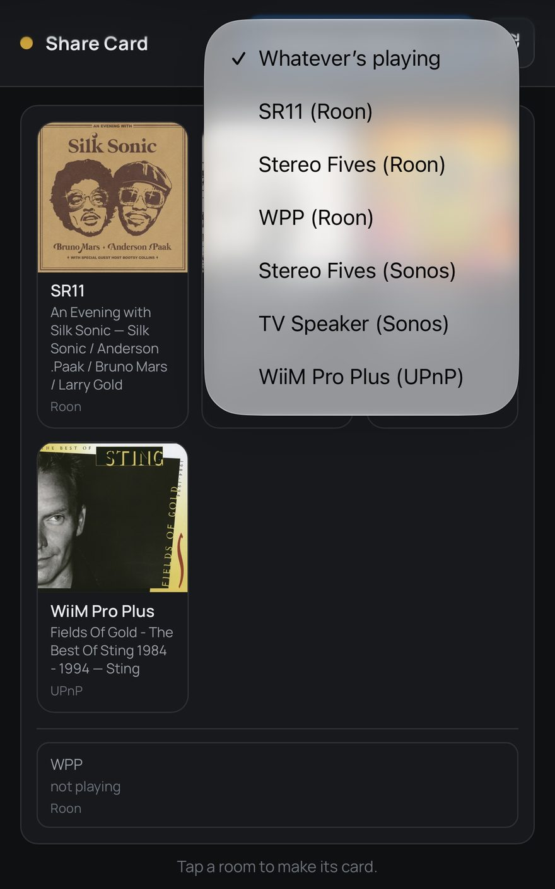
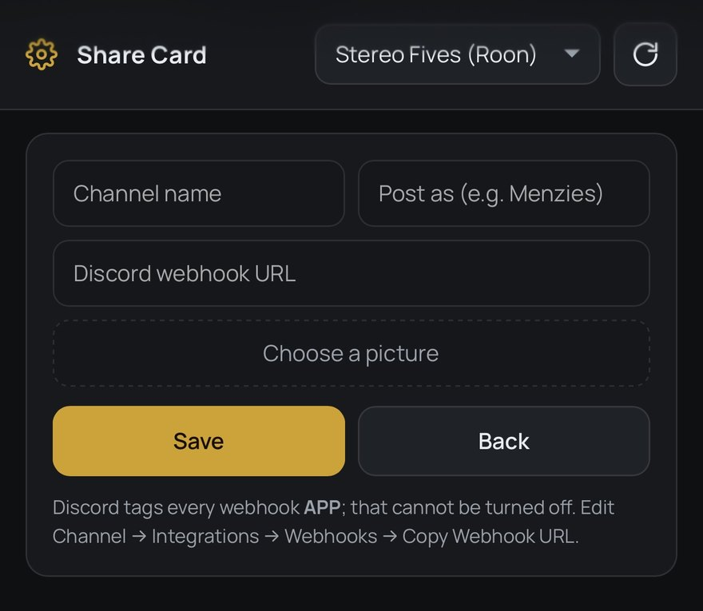

# MusicD Share Card

https://meltface-80.github.io/MusicD-Share-Card/

Makes a share card for whatever you're playing, and posts it wherever you want it.



## What it does

Open it and you get a card for the record that's on: cover, title, artist, year,
a short description from Wikipedia and a Pitchfork score where there is one.
Then share it, copy it, save it, or post it to Discord with a webhook.

Everything fits one screen — card, buttons, links, suggestions — and the page
does not scroll. The card stays put until you press **Refresh**; leaving the app
and coming back does not throw it away.



It works out what's playing by asking whoever actually knows:

- **Roon** — asked directly, through its own extension API
- **Lyrion Music Server** — asked over its JSON-RPC endpoint, so the card comes
  from the machine that owns the library rather than the endpoint playing it
- **Sonos** — for anything the speakers stream themselves (Spotify Connect,
  Apple Music via the Sonos app, radio)
- **UPnP / DLNA** — any other renderer on the network

Every room it can see is in one list, whichever source found it. Leave it on
**Whatever's playing** and one room playing goes straight to its card. More than
one and it shows them as a grid of covers instead of choosing for you — the
silent rooms listed underneath, tap either for its card. When two sources see
the same room they collapse to one tile, and the one that knows the most about
the record supplies it.

Pick a room by name and you get that room, silence included. Each zone is
independent, so a room that is not playing says so rather than showing you
what is on somewhere else.

**Rooms are opt-in.** A fresh install finds everything on the network and shows
none of it: open **Settings → Zones** and switch on the ones you want. Anything
that was powered off — a TV, an amp — joins that list the next time it answers,
switched off, so nothing appears in your picker unasked. The cog beside the
title also holds **Services** — which work the same way, switched off until you
ask for them, so the links under the card are the ones you actually use and
nothing is looked up that you don't — and the Discord webhook setup, which used
to live under the card.

On **Android**, changing any of this from another device asks for a PIN, shown
on the app's own screen — the device itself never needs it. The **Docker** build
asks for nothing by default, because a server in a cupboard has no screen to
show a PIN on and every browser is a remote one; set `SHARECARD_PIN` if you want
the gate. With it off, anyone who can reach the port can also change your
webhooks — the URLs themselves are still never handed out, only changed.

<p>
  
  
</p>

## Install

There are two builds and they are the same program. Everything that decides
anything — the sources, the card, the links — is shared; what differs is the
shell around it. Run whichever suits the machine you already leave switched on.

### Android

[**Download musicd-share-card-0.51.0.apk**](dist/musicd-share-card-0.51.0.apk)
and sideload it on an Android device running 8.0 or newer. Open it and the card
is there. That's the whole thing — nothing else to run, no server, no account.

### Docker

For a machine that is already always on — a NAS, a Pi, the box Lyrion is on. No
phone to keep awake, and nothing to sideload.

```bash
docker run -d --name musicd-share-card \
  --network host \
  -v "$PWD/sharecard-data:/data" \
  --restart unless-stopped \
  ghcr.io/meltface-80/musicd-share-card:latest
```

Then open `http://<that machine>:8747` on anything on the network.

Or with Compose — [`docker-compose.yml`](docker-compose.yml) is in the repo and
is commented:

```bash
git clone https://github.com/meltface-80/MusicD-Share-Card.git
cd MusicD-Share-Card
docker compose up -d
```

**If `docker run` answers `denied`, the image is private, not missing.** GitHub
makes every package private the first time it is published, and only the owner
can change that — repository → Packages → `musicd-share-card` → Package
settings → Change visibility → Public. Until then, build it yourself from a
clone; it is the same Dockerfile CI uses, and `docker compose up -d` does it
without any extra flag:

```bash
docker compose up -d --build
```

Three things worth knowing before you run it:

- **`--network host` is not optional if you want it to find anything.** Every
  way this app discovers a player is multicast or broadcast — SSDP for Sonos and
  UPnP, Roon's SOOD, Lyrion's UDP 3483 — and none of that crosses a Docker
  bridge. On a bridge the container comes up healthy, answers on its port, and
  finds nothing, which looks exactly like a network with no players on it. Where
  host networking isn't available (Docker Desktop on macOS and Windows, for
  one), publish `-p 8747:8747` instead and name your players' addresses in
  `SHARECARD_HOSTS`; that path needs no multicast.
- **The container runs as uid 10001**, so a directory you make yourself needs
  `sudo chown -R 10001 ./sharecard-data`. Without it the card still draws and
  everything else works — it just forgets the Roon pairing, the webhooks and the
  metadata cache on every restart, and it says so in `docker logs`.
- **Adding a Discord webhook from another device needs a PIN.** The Android
  build shows it on the device's own screen; a server in a cupboard has no
  screen, so it is printed once to the log instead — `docker logs
  musicd-share-card`. Set `SHARECARD_PIN` to a six-digit number of your own to
  skip that.

**Updating is done in the app**, the same as on Android: when a newer version
is published the page says so at the top, and **Update** downloads it, checks
it and restarts into it. Any device on the network can press it — unlike the
Android build, where the APK installs on the device running the app — and from
anywhere but the machine itself it asks for the PIN.

What that does and does not replace: the app's own code updates, the image
underneath does not. The new build is unpacked into your data directory and the
container restarts into it, because the alternative is handing this app the
Docker socket, which is root on the host, and that is not a trade worth making
for an app that answers the whole LAN. **Pull a new image now and then** —
`docker compose pull && docker compose up -d` — to pick up JRE and OS updates;
that also clears out any build the app downloaded.

An update that will not start cannot strand you: the container records what it
is trying before it runs it, and a build that never gets as far as serving is
thrown away on the next restart and the previous one comes back.

Everything the container reads:

| | |
| --- | --- |
| `SHARECARD_HOSTS` | Player or server addresses to try before searching, comma separated. IPv4 only. |
| `SHARECARD_PIN` | Six digits. **Unset by default, and unset means no PIN is asked for at all.** Set it to require one for changing settings, webhooks or updates. |
| `SHARECARD_PORT` | Default `8747`. The Android build uses 8748, so the two can run side by side. |
| `SHARECARD_DATA` | Default `/data`. Where the pairing, the webhooks, the cache and downloaded updates are kept. |
| `SHARECARD_BIND` | Default `0.0.0.0`. |
| `SHARECARD_DEBUG` | `false` quietens the log. On by default, because the log is the only diagnostic a container has. |

You can also drop a `hosts.txt` in the data directory — one address per line,
`#` for comments — which is the same file the Android build reads.

### Updating the Android app

The app updates itself. When a newer version is published it says so at the top
of the page; press **Update** and it downloads it, checks it, and hands it to
Android to install. Only the device running the app can start that — from
another device you need the PIN, the same one webhooks ask for.

Every build is signed with the same key, so a new version installs straight over
the top. The one exception was the last unsigned build — if you are still on one
of those, uninstall once and this is the last time.

## Using it from your other devices

Whichever build you run, anything else in the house can open the same card in a
browser:

```
http://<the Android device>:8748
http://<the machine running Docker>:8747
```

**The two use different ports on purpose**, so you can run both and tell them
apart by their URL. On Android — a FiiO R7, a tablet in a dock, an old phone on
a charger — the app shows its address on screen and in its notification. In
Docker it is printed to the log at startup. Nothing extra is installed on the iPad or the phone; it's
just a web page, and it is the same page either way.

| | |
| --- | --- |
| iPhone / iPad | Press and hold the card to copy or save it |
| Android | **Share…** |
| Desktop | **Copy** or **Download** |

## Roon

**Roon won't report anything until you let it in.** In Roon, go to
**Settings → Extensions** and enable **MusicD Share Card**. It only asks once —
the approval is remembered, including across restarts.

Until you do, the app will say so rather than looking broken.

It asks Roon for transport only. It doesn't browse your library, and it has no
playback controls of any kind.

## Reading about it, and finding it

Under the card is a row of links for whatever is playing:

- the **Wikipedia** article the description came from, the **Pitchfork**
  review the score came from, and **AllMusic**
- a pre-filled search on **Qobuz, TIDAL, Spotify, Apple Music, Amazon Music,
  Deezer** and **Bandcamp**

They open the service's app if you have it and its web player if you don't.
They're searches rather than links to the album itself — that needs each
service's own id for the record, and their APIs need credentials. Qobuz is the
exception: it resolves the real album and opens the app on it.

**Settings → Reviews** decides which of those appear, and can add two more
about the ARTIST rather than the record — their Wikipedia article and their
AllMusic page. Those are off until you ask for them. Switching a source off
stops it being looked up, not just drawn.

There's no Roon link. Roon has no web player and no link scheme — still an
open feature request, not an oversight — so there's nothing a tap could go
to.

**But on a card that came from a Roon zone, tapping a suggestion puts that
record on the end of that zone's queue** instead of opening a search. Only
that: it never starts or changes what is playing. If Roon doesn't have the
record — likely, since a suggestion is something you haven't played — the tap
opens the streaming search as it always did.

## If you like this, try these

Three acts worth hearing next, with one album each, under the links. They come
from ListenBrainz where it answers and Deezer otherwise — no account, no key.

Nothing keyless does album-to-album similarity, so these are artists *like* this
artist rather than records like this record, and the heading says so.

**Hold a service chip** — Qobuz, TIDAL, whichever — and it takes a tick. That's
where the suggestions link to from then on. It's remembered per device, so your
phone and the iPad can differ. There's no settings screen for it.

## Discord

Paste a webhook URL once and a button appears on the card for it. Tap it and the
card is posted — no share sheet, no saving a file first. Add as many as you like;
each gets its own button.

You can give it your own name and picture — pick a photo and it's uploaded to
Discord — but Discord tags every webhook message **APP** and there's no way to
turn that off.

Get the URL from Discord: **Edit Channel → Integrations → Webhooks → Copy
Webhook URL**.



## If something looks wrong

Press **Find my speakers**. It runs the whole search and tells you what it found,
what it didn't, and the most likely reason — plus what the Pitchfork and
suggestion lookups were asked and what they answered. An empty row has several
causes that look identical from the card, and that page tells them apart.

It's also where the last crash goes, so "it just closed" comes with a trace. In
Docker the same detail is in `docker logs`, which is on from the start — a
container has no other window to look through.

## Licence

MIT — see [LICENSE](LICENSE).

The card is [MusicD Remote Lite's](https://github.com/meltface-80/Android-Random-Remote),
ported so both apps draw the same picture, and the Roon client comes from there
too. Album text is from Wikipedia under CC BY-SA, which is why the credit stays
on the card.
